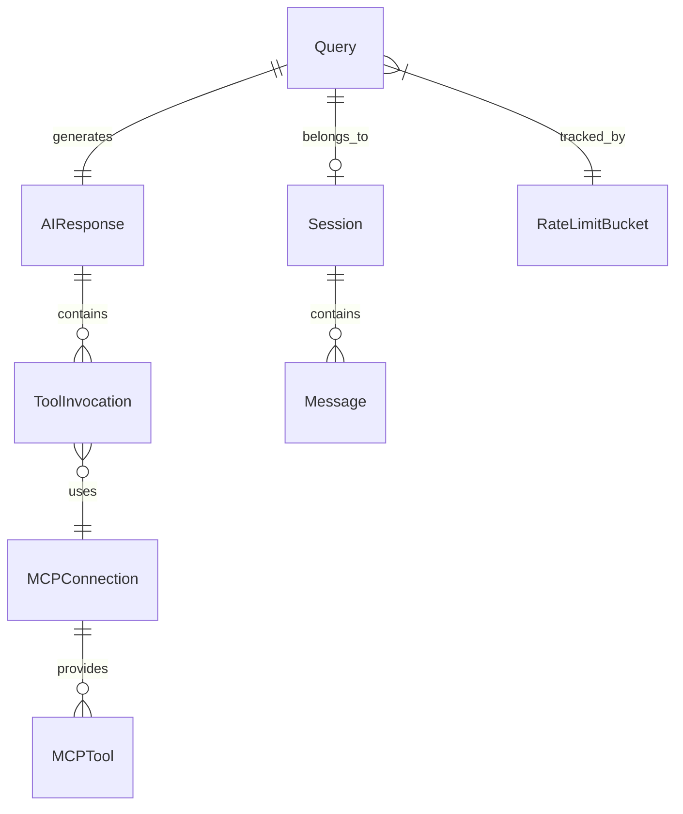

# Data Model: OpenAI-Compatible MCP Middleware

## Core Entities

### Query
**Description**: Represents a user's natural language query
**Fields**:
- `id`: str (UUID) - Unique query identifier
- `content`: str - The user's question or command
- `session_id`: Optional[str] - Associated session for context
- `provider`: Optional[str] - Requested LLM provider ('openai' | 'huawei_maas')
- `timestamp`: datetime - When query was received
- `metadata`: Dict[str, Any] - Additional context (client_ip, user_agent, etc.)

**Validation**:
- content: Required, min_length=1, max_length=4000
- provider: Must be valid provider if specified

### AIResponse
**Description**: Response generated by the LLM with tool execution results
**Fields**:
- `id`: str (UUID) - Unique response identifier
- `query_id`: str - Reference to original query
- `content`: str - The AI's response text
- `tool_calls`: List[ToolInvocation] - Tools that were invoked
- `provider_used`: str - Which LLM provider was used
- `model`: str - Specific model used (e.g., 'gpt-4o')
- `usage`: Dict[str, int] - Token usage statistics
- `timestamp`: datetime - When response was generated
- `duration_ms`: int - Total processing time

**Validation**:
- query_id: Must reference existing query
- provider_used: Must be valid provider

### MCPConnection
**Description**: Active connection to an MCP server
**Fields**:
- `id`: str - Connection identifier
- `transport_type`: str - 'stdio' | 'sse'
- `server_url`: Optional[str] - For SSE transport
- `command`: Optional[str] - For stdio transport
- `status`: str - 'connecting' | 'connected' | 'disconnected' | 'error'
- `available_tools`: List[MCPTool] - Discovered tools
- `created_at`: datetime - Connection established time
- `last_used`: datetime - Last tool invocation time
- `error_message`: Optional[str] - If status is 'error'

**State Transitions**:
```
connecting → connected → disconnected
connecting → error
connected → error → connecting (retry)
```

### ToolInvocation
**Description**: Record of a single MCP tool execution
**Fields**:
- `id`: str - Invocation identifier
- `tool_name`: str - Name of the MCP tool
- `arguments`: Dict[str, Any] - Arguments passed to tool
- `result`: Optional[Any] - Tool execution result
- `error`: Optional[str] - Error message if failed
- `started_at`: datetime - Execution start time
- `completed_at`: Optional[datetime] - Execution end time
- `duration_ms`: Optional[int] - Execution duration

**Validation**:
- tool_name: Must be available in connected MCP server
- arguments: Must match tool's input schema

### Session
**Description**: Conversation context for multiple queries
**Fields**:
- `id`: str (UUID) - Session identifier
- `created_at`: datetime - Session creation time
- `updated_at`: datetime - Last activity time
- `messages`: List[Message] - Conversation history
- `context`: Dict[str, Any] - Shared context data
- `provider_preference`: Optional[str] - Preferred LLM provider
- `max_messages`: int = 20 - Maximum context messages

**Message Structure**:
```python
{
    "role": "user" | "assistant" | "tool",
    "content": str,
    "tool_calls": Optional[List],
    "tool_call_id": Optional[str]
}
```

### MCPTool
**Description**: Available MCP tool definition
**Fields**:
- `name`: str - Tool identifier
- `description`: str - Human-readable description
- `input_schema`: Dict[str, Any] - JSON Schema for arguments
- `output_schema`: Optional[Dict[str, Any]] - Expected output format

### RateLimitBucket
**Description**: Rate limiting state per client
**Fields**:
- `client_id`: str - Client identifier (IP address)
- `tokens`: float - Available tokens
- `capacity`: int = 10 - Maximum tokens
- `last_refill`: datetime - Last refill time
- `request_count`: int - Total requests
- `last_request`: datetime - Most recent request

## Relationships



## Data Flow

1. **Query Processing**:
   - User submits Query
   - Query associated with Session (if provided)
   - Rate limit checked against RateLimitBucket
   - LLM provider selected based on Query.provider or default

2. **Tool Discovery**:
   - MCPConnection established with transport
   - MCPTools discovered and cached
   - Tools converted to OpenAI format

3. **LLM Interaction**:
   - Query + Session.messages sent to LLM
   - LLM returns tool_calls
   - Each tool_call creates ToolInvocation

4. **Tool Execution**:
   - ToolInvocations executed via MCPConnection
   - Results collected and sent back to LLM
   - Final AIResponse generated

5. **Session Update**:
   - Query and AIResponse added to Session.messages
   - Session.updated_at refreshed
   - Old messages pruned if > max_messages

## Persistence Strategy

**In-Memory** (MVP):
- Sessions: Dict with TTL (1 hour)
- Rate limit buckets: Dict with cleanup
- Connection pool: Managed lifecycle

**Future Considerations**:
- Redis for session storage
- PostgreSQL for query/response history
- Time-series DB for metrics

## Concurrency Considerations

- **Sessions**: Thread-safe with asyncio.Lock
- **Connections**: Pool with semaphore limits
- **Rate Limits**: Atomic operations with locks
- **Tool Calls**: Parallel execution with gather()

## Error States

### Query Errors
- `INVALID_QUERY`: Malformed or empty query
- `RATE_LIMITED`: Exceeded rate limit
- `SESSION_NOT_FOUND`: Invalid session_id

### Connection Errors
- `CONNECTION_FAILED`: Cannot connect to MCP server
- `TRANSPORT_ERROR`: Transport-specific failure
- `TIMEOUT`: Connection or tool timeout

### Tool Errors
- `TOOL_NOT_FOUND`: Requested tool unavailable
- `INVALID_ARGUMENTS`: Schema validation failed
- `EXECUTION_ERROR`: Tool returned error

### Provider Errors
- `PROVIDER_UNAVAILABLE`: LLM API down
- `AUTHENTICATION_FAILED`: Invalid API key
- `QUOTA_EXCEEDED`: Provider limits reached

---
*Data model designed for async operations, scalability, and clear error handling*